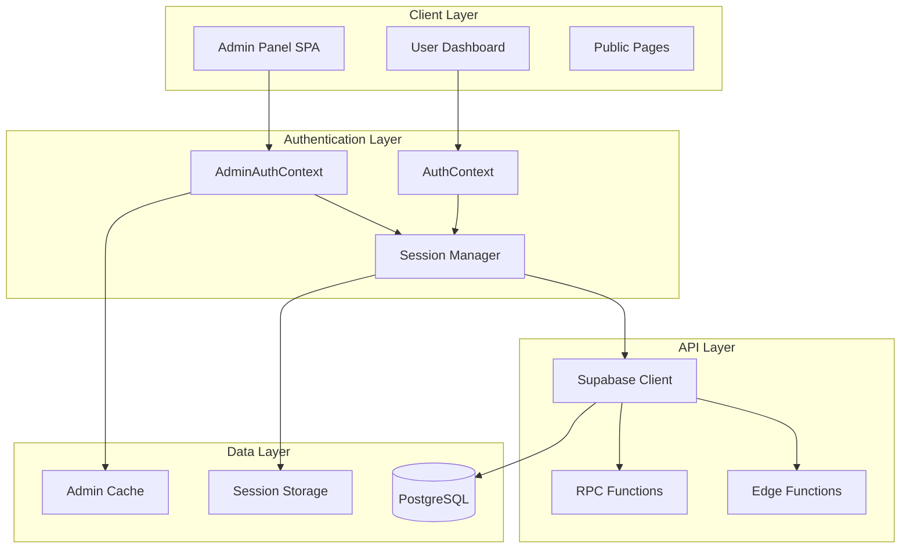
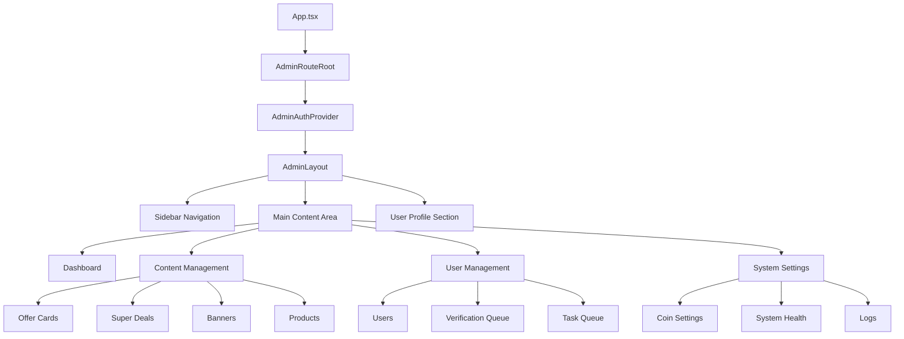

# Design Document: Admin Panel Modernization & Platform Reorganization

## Overview

This design document outlines the comprehensive modernization of the DopeDeal admin panel and reorganization of the platform's content structure. The current admin panel uses an outdated UI system and layout, experiences session management issues (logout on refresh/navigation), and contains legacy content that needs to be redistributed across the new platform architecture.

The modernization will address three core areas:
1. **Admin Panel UI/UX Modernization**: Update the visual design, color theme, navigation structure, and component library to match the current platform aesthetic
2. **Session Management & Authentication**: Fix logout issues on refresh/navigation and implement robust session persistence
3. **Content Reorganization**: Analyze legacy content (referral earning types, online earning apps, super deals, offer cards) and redistribute them into appropriate sections of the modernized platform

This design combines both high-level architectural diagrams and low-level implementation specifications to provide a complete blueprint for the modernization effort.

---

## Architecture

### High-Level System Architecture



### Admin Panel Component Hierarchy



### Session Management Flow

```mermaid
sequenceDiagram
    participant U as User
    participant B as Browser
    participant AC as AdminAuthContext
    participant SC as Session Cache
    participant SB as Supabase Auth
    participant DB as Database (RPC)
    
    U->>B: Navigate to /admin
    B->>AC: Mount AdminAuthProvider
    AC->>SC: Check cache (isAdminCacheFresh)
    
    alt Cache is fresh
        SC-->>AC: Return cached admin status
        AC->>B: Render admin panel (no loading)
    else Cache is stale/missing
        AC->>SB: getSession()
        SB-->>AC: Return session
        AC->>DB: RPC: is_admin()
        DB-->>AC: Return admin status
        AC->>SC: Write cache
        AC->>B: Render admin panel
    end
    
    U->>B: Refresh page / Navigate
    B->>AC: Re-mount (but cache persists)
    AC->>SC: Check cache
    SC-->>AC: Return cached status (fast path)
    AC->>B: Render immediately (no logout)
    
    Note over AC,DB: Background refresh (non-blocking)
    AC->>DB: RPC: is_admin() (silent)
    DB-->>AC: Update cache


---

## Correctness Properties

*A property is a characteristic or behavior that should hold true across all valid executions of a system—essentially, a formal statement about what the system should do. Properties serve as the bridge between human-readable specifications and machine-verifiable correctness guarantees.*

### Property 1: Session Persistence Across State Changes

*For any* authenticated admin session, performing state changes (page refresh, navigation between routes, or cache restoration) SHALL preserve the authentication state without requiring re-login.

**Validates: Requirements 1.1, 1.2, 1.3**

### Property 2: Cache Management with Freshness and Fallback

*For any* admin session state, the cache SHALL correctly determine freshness based on TTL, use cached data when fresh, and fall back to Supabase authentication with cache update when stale or missing.

**Validates: Requirements 1.3, 1.4, 1.5**

### Property 3: Admin Verification and Authorization

*For any* user attempting to access admin routes, the system SHALL verify admin privileges via RPC, store successful verification in cache with timestamp, and deny access to non-admin users.

**Validates: Requirements 2.1, 2.3**

### Property 4: Authentication Failure Redirect

*For any* authentication failure scenario (failed verification or expired session), the system SHALL clear the admin cache and redirect to the login page.

**Validates: Requirements 2.2, 2.5**

### Property 5: Responsive Layout Adaptation

*For any* viewport size, the admin panel layout SHALL adapt appropriately to maintain usability and visual hierarchy.

**Validates: Requirements 3.3**

### Property 6: Interactive Element Feedback

*For any* user interaction with UI elements (clicks, hovers, form submissions), the system SHALL provide immediate visual feedback within the specified time threshold.

**Validates: Requirements 3.6, 9.5**

### Property 7: SPA Navigation Without Reload

*For any* navigation item click, the system SHALL route to the corresponding page without full page reload and display the active page indicator in the sidebar.

**Validates: Requirements 4.2, 4.3**

### Property 8: Logout Session Cleanup

*For any* authenticated admin session, executing logout SHALL clear all session data from cache and redirect to the login page.

**Validates: Requirements 4.5**

### Property 9: Content List Pagination

*For any* content list (offers, deals, banners, products, users) and page size configuration, the pagination system SHALL correctly divide content into pages and allow navigation between pages.

**Validates: Requirements 5.2**

### Property 10: Form Validation with Error Messages

*For any* invalid form input during content creation or editing, the system SHALL prevent submission, display clear validation error messages, and maintain form state.

**Validates: Requirements 5.3**

### Property 11: Content Save Confirmation and Update

*For any* valid content save operation (content management, user actions, system settings), the system SHALL display confirmation feedback and immediately update the relevant UI display.

**Validates: Requirements 5.4, 7.4, 8.5**

### Property 12: Image Upload and Preview

*For any* valid image file upload, the system SHALL accept the upload and display a preview of the image before final submission.

**Validates: Requirements 5.5**

### Property 13: Search and Filter Correctness

*For any* search query or filter combination across content, users, or logs, the system SHALL return only results matching the specified criteria.

**Validates: Requirements 5.6, 7.5, 8.3**

### Property 14: Legacy Content Categorization

*For any* legacy referral earning type, the categorization function SHALL map it to exactly one appropriate offer category in the modernized structure.

**Validates: Requirements 6.1**

### Property 15: Earning App Migration Logic

*For any* online earning app with defined characteristics, the migration function SHALL assign it to the correct section (offers or deals) based on those characteristics.

**Validates: Requirements 6.2**

### Property 16: Content Data Integrity During Reorganization

*For any* offer card undergoing reorganization, all data fields SHALL be preserved without loss or corruption (round-trip property: original data equals reorganized data).

**Validates: Requirements 6.4**

### Property 17: Migration Audit Logging

*For any* content migration operation, the system SHALL create an audit log entry recording the migration details.

**Validates: Requirements 6.5**

### Property 18: Migration Report Accuracy

*For any* completed content migration, the generated report SHALL accurately reflect the distribution of content across new categories (report totals equal actual content counts).

**Validates: Requirements 6.6**

### Property 19: Settings Input Validation

*For any* invalid settings input value, the system SHALL reject the input with validation errors before attempting to save.

**Validates: Requirements 8.4**

### Property 20: Comprehensive Error Handling

*For any* error condition (data operation failure, navigation error, network failure), the system SHALL display user-friendly error messages and provide recovery options (retry, navigation alternatives) while preserving user data.

**Validates: Requirements 9.1, 9.2, 9.3**

### Property 21: Toast Notification Display

*For any* system event requiring user notification (success, error, information), the system SHALL display a toast notification with the appropriate type and message.

**Validates: Requirements 9.4**

### Property 22: Dashboard Refresh Without Reload

*For any* dashboard data refresh operation, the system SHALL update all metrics without triggering a full page reload.

**Validates: Requirements 10.5**

### Property 23: Keyboard Navigation Accessibility

*For any* interactive element in the admin panel, the element SHALL be accessible via keyboard navigation with visible focus indicators.

**Validates: Requirements 12.1, 12.4**

### Property 24: Color Contrast Compliance

*For any* text and background color combination used in the admin panel, the contrast ratio SHALL meet WCAG accessibility standards.

**Validates: Requirements 12.2**

### Property 25: ARIA Attribute Completeness

*For any* interactive element requiring screen reader support, the element SHALL include appropriate descriptive labels and ARIA attributes.

**Validates: Requirements 12.3**
